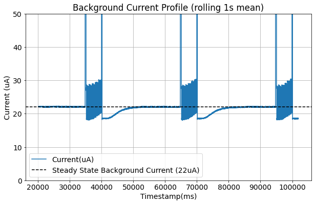
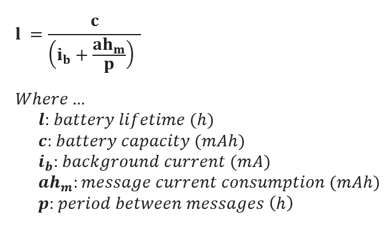
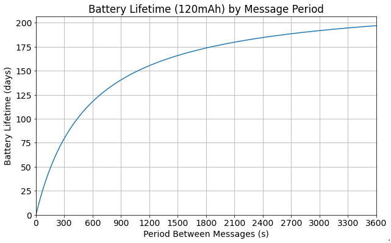

# Combined Library Firmware Example

This example is intended to show how the [three libraries](../../lib/) provided in this repo can be used in a [Low Power Mode](#low-power-mode).

It is intended to be the leaping off point for further development of the firmware once the user is familiar with the libraries: how to use **and** extend them.

## Dependencies

Hardware:

- WisBlock Base & RAK4630
- WisBlock Sensors (RAK1901 & RAK1906) if using (see SensorHelper.h).

Software:

- Arduino.h
- [LoRaWan-RAK4630.h](../../#environment-setup)
- [Logging.h](../../lib/Logging/)
- [LoRaWAN_functs.h](../../lib/LoRaWAN_functs/)
- [PortSchema.h](../PortSchema/)
- [SensorHelper.h](../../lib/SensorHelper/)

## Usage

Steps:

1. Copy the contents of Combined_lib_example.cpp into your main.cpp.
2. Follow the steps to setup your [OTAA keys](../../lib/LoRaWAN_functs/#otaa-keys) (if not already completed).
3. Copy the example port schema provided in [PortSchema](../../lib/PortSchema/#usage) by copying the contents of [PortSchema\examples\example_port_schema]](../../lib/PortSchema/examples/example_port_schema) folder to the same file location as your main file.
4. Set the `payload_port` to the port desired; see [Port Definitions](../../lib/PortSchema/#port-definitions).
5. Check that the correct sensors have been inserted into the base board.
6. Set the logging level to the desired level; see [Logging](../../lib/Logging/).
7. Set the `lorawan_app_interval` to the interval desired, being mindful of the limitations imposed by the community LoRaWAN and Ubidots data throughput rate.
8. Compile & flash.

Then to see the sensor data coming through you can check by:

- Opening a Serial monitor (if logging is enabled)
- Going to the TTS application live stream to monitor the incoming data frames
- Going to the Udibots dashboard, and for further detail: the logs section of the Ubidots TTS Plugin.

## Low Power Mode

This example uses the Semaphore feature provided by FreeRTOS combined with a SoftwareTimer to put the device to 'sleep' whilst it waits for an event that switches the task.

Essentially the device will be in the sleep task most of the time and will wake periodically to send the sensor data.

### Semaphores

_Please see [this](https://news.rakwireless.com/how-to-reduce-the-power-consumption-of-wisblock-solutions/) blog post from RAK for more details on using delay and Semaphores to put the RAK4631 to 'sleep'._

The TL;DR of that blog post: a binary Semaphore is a one item queue (essentially empty or full). To place an item in the queue we **give** the semaphore with `xSemaphoreGive()` (or `xSemaphoreGiveFromISR()` inside an interrupt), this single queue item is then available to be taken with `xSemaphoreTake()`.Te key is that a semaphore cannot be taken without first being given.

The low power trick results from giving `xSemaphoreTake()` a block time to wait for the semaphore to become available, and whilst it is waiting the device is put to 'sleep'.

### Example Explanation

_(Refer to the example code file whilst reading this)_

The main `loop()` is a switch-case that switches between the different tasks - similar to a finite state machine design. For now there are only two tasks (or states): sleep and send payload; but more can be added as needed.

```c++
enum class EVENT_TASK {
    SLEEP,        /**< Use semaphore take to "sleep" in a low power state. */
    SEND_PAYLOAD, /**< Send a sensor reading payload. */
};
static EVENT_TASK current_task = EVENT_TASK::SLEEP; /**< Current task of the device used in loop() to switch between tasks. */
```

The device goes to sleep by calling `xSemaphoreTake(semaphore_handle, portMAX_DELAY)`. As [mentioned above](#Semaphores), this will cause the device to wait (up to `portMAX_DELAY` ticks) for the `semaphore_handle` to be available.

The device will stop sleeping when it exits the `xSemaphoreTake()` function call and the `break` of the switch-case will be hit again.
If the semaphore was not given (and `xSemaphoreTake()` timed out), then the **current task has not changed** and the device will **immediately go back to the sleep** task.

The current taks will only switch to send payload when the SoftwareTimer timeout handler function is triggered. This both **changes the current task** and **gives the semaphore**:

```c++
void appTimerTimeoutHandler(TimerHandle_t unused) {
    current_task = EVENT_TASK::SEND_PAYLOAD;
    xSemaphoreGiveFromISR(semaphore_handle, pdFALSE);
}
```

This means `xSemaphoreTake()` can take the semaphore and the switch-case will now go to the send payload task.

Once the send payload task has been completed it changes the current task back to sleep.

### Observed Power Consumption with Semaphores

_Power consumption was observed with a Nordic Power Profiler Kit for one of the devices over a relatively short period of time, but it is indicative of the type of performance achieved with Semaphores._

Essentially the background (rest state) current was ~22uA, with current spikes when the LoRa radio is turned on to transmit up to 70-100mA. It then stays higher for a short period afterwards (as expected with a Class A device) before returning to the rest state.

The current consumption for each message was found to be ~3.4uAh.



The battery lifetime can then be given with:





**NOTE:** The background current of another WisBlock flash with the same code (measured with a multimeter) was 35uA. I have no explanation for this difference, it definitely requires further investigation.
